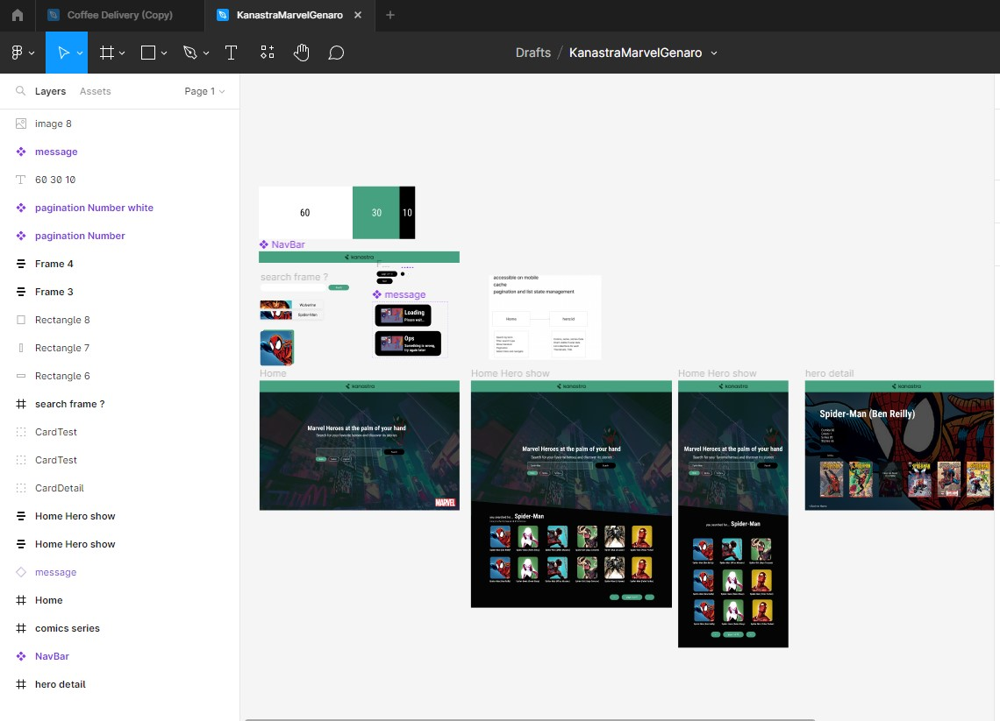
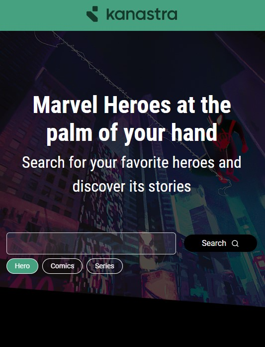
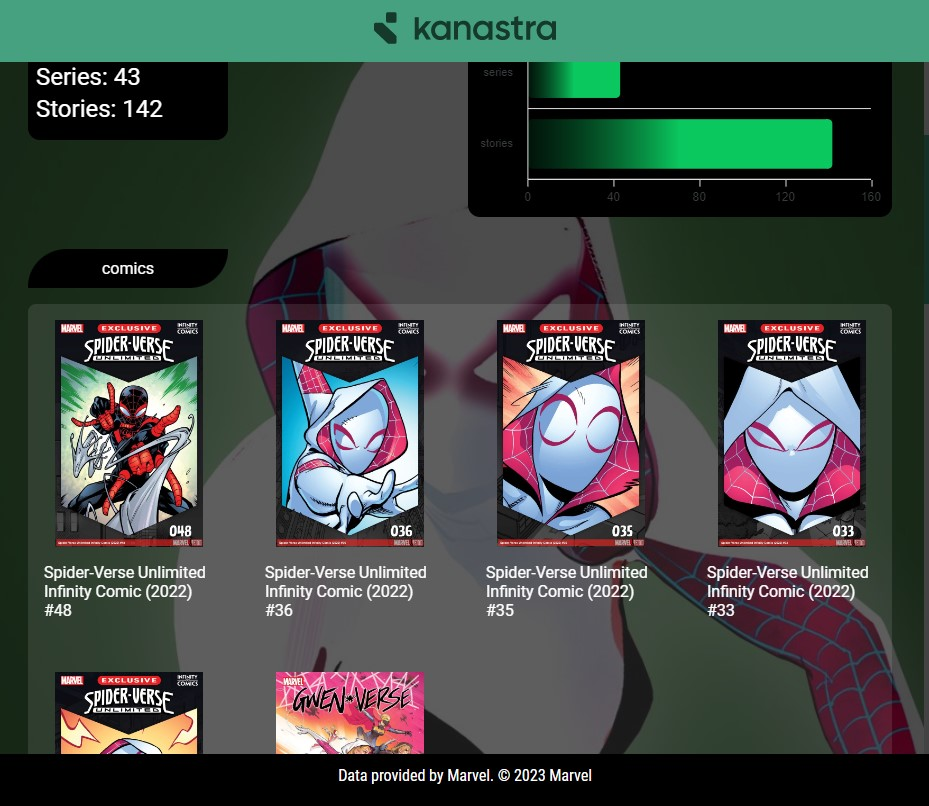

# Marvel Kanastra Genaro Test

Developed using React, Typescript, styled-components, useQuery, react Intl, gsap + Vite

#### 🎨 Figma file I made before start coding

[check it out here](https://www.figma.com/file/8PmgxpTN3zdYcykNjvRxge/KanastraMarvelGenaro?type=design&node-id=0%3A1&t=RHFaQdae5xvo3BUr-1 "check it out here")

#### 🖥 How to run

You must create a .env.local and create the following variables:

```javascript
VITE_MARVEL_API_BASEURL = "http://gateway.marvel.com/v1/public";
VITE_MARVEL_API_PUBLIC_KEY = " ";
VITE_MARVEL_API_PRIVATE_KEY = " ";
```

Fill API Keys with your data from https://developer.marvel.com/account#

`Npm i  ` to install project dependencies .
`Npm run dev  ` to run project in your machine .
`Npm run cypress:open` to run cypress tests.

### Live Demo can be found [here](https://marvel-genaro-kanastra-test.vercel.app/ "here")

##### Screenshots






